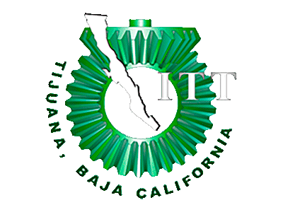

# Analisis-Avanzado-de-Software-Mancilla-Mora

#  Información #

**Nombre del alumno:** Mancilla Mora Moises

**Número de control:** 17212922.

**Carrera:** Ing. en Tecnologias de la Información y Comunicaciones.

**Nombre del equipo:** Ethereal Arts

**Nombre del maestro:** Jaime Leonardo Enriquez Alvarez.

**Materia:** Analisis Avanzado de
Software

# Índice #

#  Unidad 1

**Carpeta Blog**
* [C0.1 Integrar equipos](https://github.com/MoisesMM99/Analisis-Avanzado-de-Software-Mancilla-Mora/blob/main/PDF/C0.1_IntegrarEquiposdeTrabajo_MancillaMoraMoises.md)
* [C0.2 Tipo de Sistema de información](https://github.com/MoisesMM99/Analisis-Avanzado-de-Software-Mancilla-Mora/blob/main/PDF/C0.2%20%20Tipo%20de%20sistema%20de%20informaci%C3%B3n.md)
* [C0.3_Diagrama de flujo sobre el proceso de desarrollo](https://github.com/MoisesMM99/Analisis-Avanzado-de-Software-Mancilla-Mora/blob/main/PDF/C0.3%20Diagrama%20de%20flujo%20del%20proceso_MancillaMoraMoises.md)
* [A0.1 Recopilación de datos por medio de la entrevista](https://github.com/MoisesMM99/Analisis-Avanzado-de-Software-Mancilla-Mora/blob/main/PDF/A0.1_Data_collection_through_the_interview_MancillaMoraMoises.md)
  
**Carpeta Docs**

#  Unidad 2
* [C1.1 Definición de Objetivo general y los especificos, asi como el modelado del negocio.](https://github.com/MoisesMM99/Analisis-Avanzado-de-Software-Mancilla-Mora/blob/main/PDF/C0.1_IntegrarEquiposdeTrabajo_MancillaMoraMoises.md)

**Carpeta Blog**

